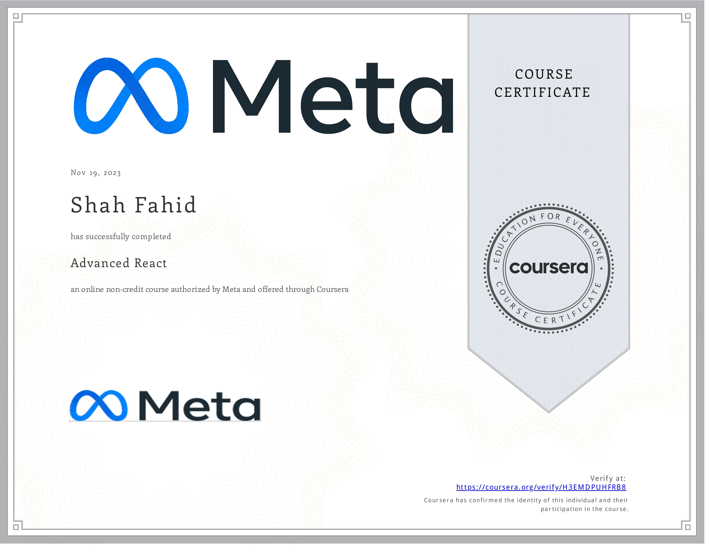

# React Advance Course and Portfolio



Welcome to the repository showcasing my work during the React Advance Course and the projects included in my portfolio.

## React Advance Course

During this course, I delved into advanced concepts of React, including state management, hooks, context API, and more. The following projects were completed as part of the course:

- **GitHub Repository:** [https://github.com/mrfahid/Your-React-Advance-Course-Repository.git]

## Portfolio

### Overview

This portfolio showcases my skills, projects, and achievements as a React developer. It includes a collection of projects that highlight my proficiency in building robust and scalable React applications.

### Projects Included

1. [Project 1: Project Name](#) - Brief description.
2. [Project 2: Project Name](#) - Brief description.
   <!-- Add more projects as needed -->

### Tech Stack

- React
- Other technologies you utilized

### Certificate


### Getting Started

1. Clone the repository:

   ```bash
   git clone https://github.com/mrfahid/My-meta-frontend-developer-professional-certificate.git
   cd My-meta-frontend-developer-professional-certificate
   npm install
   npm start

   ```

Open http://localhost:3000 in your browser.
### Contributors
Shah Fahid
Contact
If you have any questions, suggestions, or issues, feel free to reach out:

Email: shahfahidbaloch@gmail.com
LinkedIn: Shah Fahid
Happy coding and calculating!